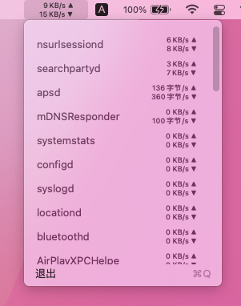
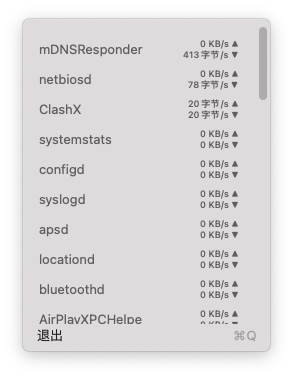

#  Network Status Bar

A macos status bar tool for monitoring network trffic write in **Swift UI 2.0**.

## snapshots

 

## feature

- [x] Swift UI 2.0 Base.
- [x] Show network IO on status bar.
- [x] Show per application network on dropdown menu.
- [ ] Support refresh seconds customize.
- [ ] Support application deny list,such as proxy applications.
